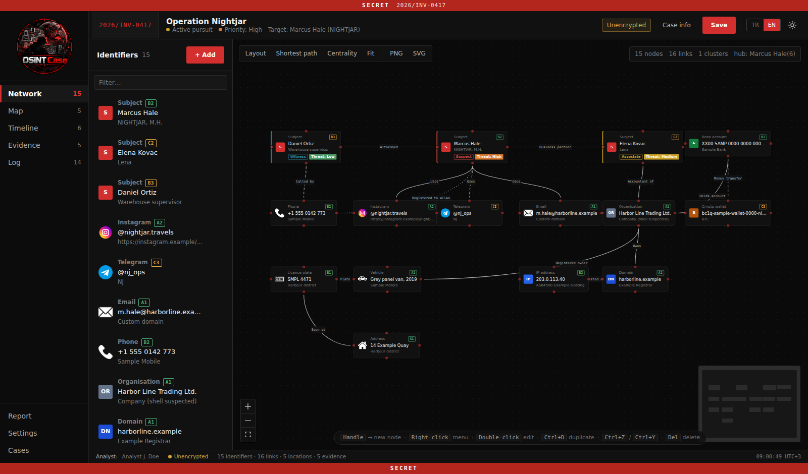
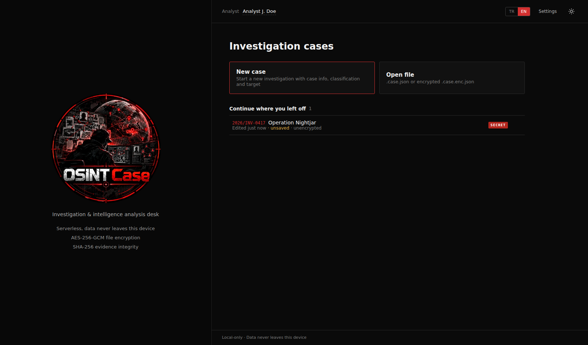
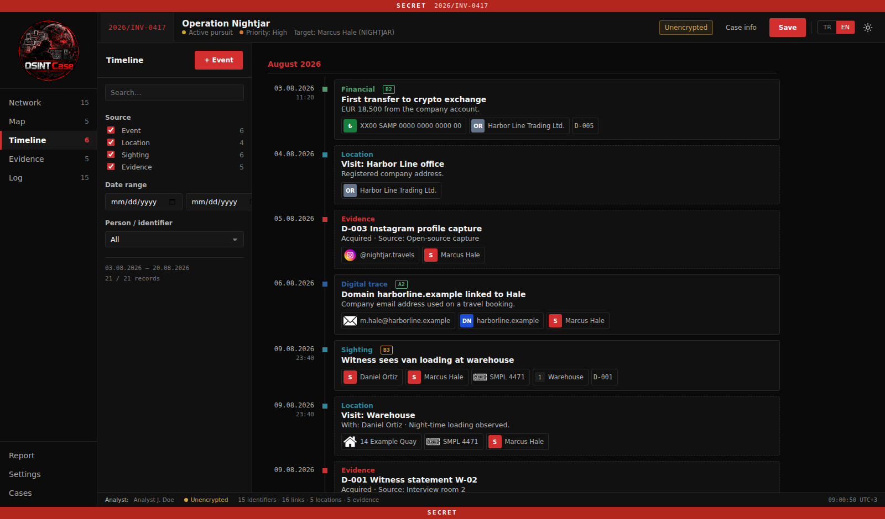
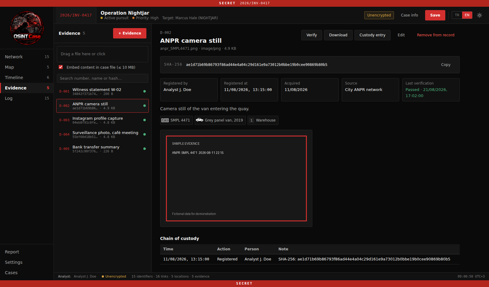
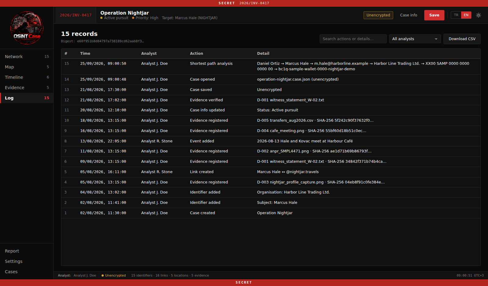
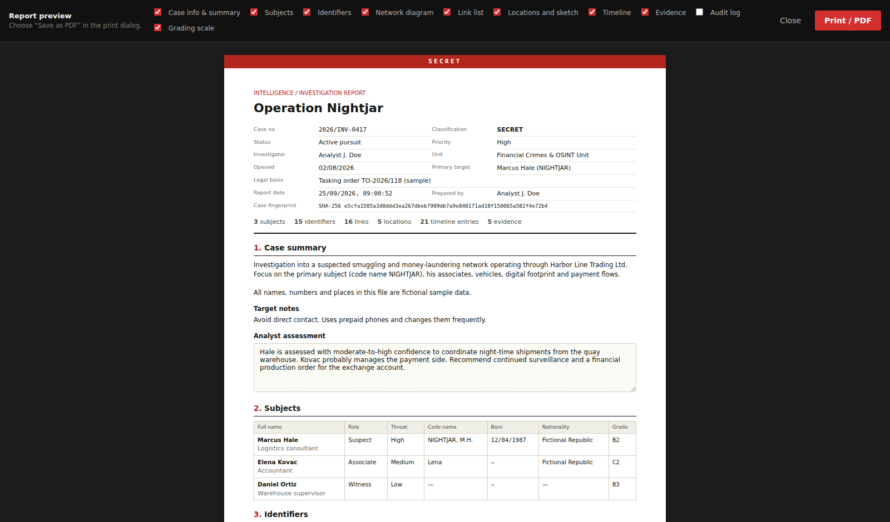

# OsintCase

A browser-based OSINT investigation and case mapping tool.

Organize subjects, identifiers, relationships, locations, timelines and evidence in a single case file.



## Screenshots

| Home | Network |
|---|---|
|  |  |

| Timeline | Evidence |
|---|---|
|  |  |

| Audit Log | Report |
|---|---|
|  |  |

## Features

- Investigation case management
- Entity and identifier mapping
- Relationship and link analysis
- Location mapping
- Investigation timeline
- Evidence management
- SHA-256 evidence hashing
- Chain of custody
- Audit log
- Intelligence report generation
- Case file import and export
- Optional AES-256-GCM encryption
- Turkish and English interface
- Dark and light themes
- Fully client-side

## Quick Start

Requires **Node.js 18+**.

```bash
npm install
npm run dev
```

Open `http://localhost:5173`.

## Docker

```bash
docker compose up --build
```

Then open `http://localhost:5173`.

## Sample Case

A fictional investigation is included:

`examples/operation-nightjar.case.json`

Open the file from the application to explore the sample investigation.

## Privacy

OSINT Case runs entirely in the browser.

No server, analytics or telemetry is used. Case data and evidence remain on the local device.

## License

[GPL-3.0](LICENSE)
