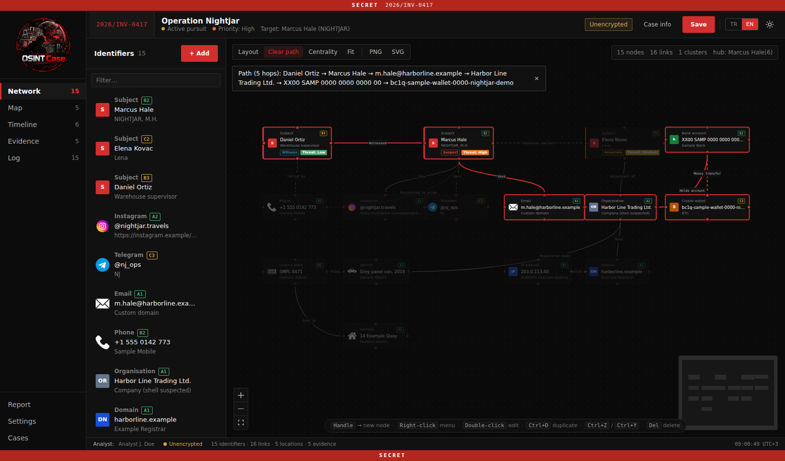
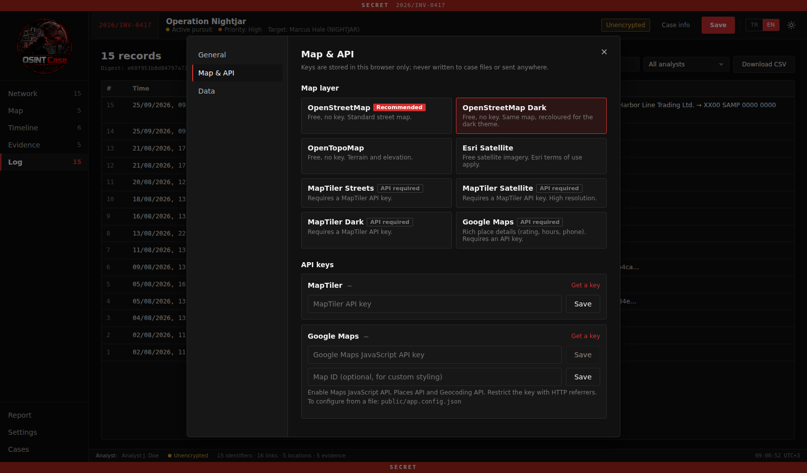

# OSINT Case

A serverless investigation and intelligence analysis desk that runs entirely in the browser. Map subjects and identifiers on a link graph, pin locations on a map, build a timeline of events and register evidence with SHA-256 integrity, all in a single case file. Nothing leaves your device.


## Try the sample case

`examples/operation-nightjar.case.json` is a complete, fictional case you can open right away: **Open file** on the home screen, then pick the file. It contains 3 subjects, 15 identifiers, 16 graded links, 5 locations with sightings, a timeline, 5 evidence items with chain of custody and a full audit log. A printed report generated from it is in [`docs/sample-report.pdf`](docs/sample-report.pdf).

All names, numbers, addresses and accounts in the sample are invented.

## Screenshots

| | |
|---|---|
|  Home screen |  Shortest path between two nodes |
|  Timeline |  Evidence locker and chain of custody |
|  Audit log |  Printable report |
|  Map layers and API keys | |

## Getting started

Requires Node.js 18+.

```bash
npm install
npm run dev        # http://localhost:5173
npm run build      # production build → dist/
npm run preview    # serve the build on http://localhost:4173
```

### Docker

```bash
cp .env.example .env     # optional, only needed for Google Maps
docker compose up --build
```

Then open http://localhost:5173. OpenStreetMap works without any key; a Google Maps key can be supplied through `.env`.

## First run

A short setup wizard walks you through four steps:

1. **Language:** Türkçe or English
2. **Map layer:** OpenStreetMap is recommended and works immediately
3. **API key:** only shown if the chosen layer needs one; can be skipped
4. **Analyst name:** written automatically to the audit log and chain of custody

Everything can be changed later under **Settings**.

## Workspace

| Section | What it does |
|---|---|
| **Network** | Identifiers as nodes and the links between them. Auto layout, shortest path, centrality, PNG/SVG export |
| **Map** | Locations, route line, radius rings, density layer (pattern of life), sightings |
| **Timeline** | Manual events, location visits, sightings and evidence on one chronological view |
| **Evidence** | Evidence locker with SHA-256 hashing, chain of custody and verification |
| **Log** | Audit log of every change: who did what and when. CSV export |
| **Report** | Printable A4 intelligence report (Print / Save as PDF) |

## Features

**Case management**
- Case number, classification, status, priority, investigator, unit, opening date, legal basis and summary
- Classification banner on every screen and every printed page: UNCLASSIFIED · RESTRICTED · CONFIDENTIAL · SECRET · TOP SECRET

**Identifiers**
- Subject (role: suspect, defendant, witness, victim, associate, informant; threat level; code name, nationality, ID number, description)
- Social media accounts, email, phone, address, family member, organisation, ID document
- IP address, domain, device (IMEI / MAC), crypto wallet, bank account, vehicle, licence plate, VIN
- Custom types and custom icons

**Analysis**
- NATO Admiralty grading (A–F / 1–6) on every identifier and event, shown on the node
- Link relation type and confidence (confirmed / probable / doubtful → solid / dashed / dotted line)
- Force-directed auto layout (undo with Ctrl+Z)
- Shortest path between two selected nodes, link count per node, cluster count
- Map radius rings, sightings and density layer

**Evidence**
- SHA-256 computed in the browser; file content optionally embedded in the case file (≤ 10 MB)
- Chain of custody entries (received, handed over, stored, examined…)
- Re-verification: prove a file has not been altered since it was registered
- Removing evidence requires a reason and is logged

**Security**
- Optional file password: AES-256-GCM, key derived with PBKDF2-SHA256 (600,000 rounds)
- Recovery snapshots stored in IndexedDB; for encrypted cases the snapshot is encrypted too
- Automatic recovery snapshots can be turned off
- Warning when a highly classified case is about to be saved without encryption

**Interface**
- Turkish and English, switchable at any time (reports included)
- Dark and light themes
- Uses the operating system's own font; no external fonts are loaded

## Settings

- **General:** language, theme, analyst name, automatic recovery snapshots
- **Map & API:** map layer and API keys
  - No key: OpenStreetMap (default), OpenStreetMap Dark, OpenTopoMap, Esri Satellite
  - Key required: MapTiler (Streets / Satellite / Dark), Google Maps (+ optional Map ID)
- **Data:** wipe all local data from this browser

API keys are kept in the browser only. They are never written to case files or sent anywhere else. If a map layer fails to load, a notice appears with a one-click switch back to OpenStreetMap.

## File format

- Case file: `<name>.case.json`
- Encrypted case file: `<name>.case.enc.json`
- Older `.osint.json` files open as well.

## Privacy

No server, no analytics, no telemetry. The only outbound requests are map tiles and address search (OpenStreetMap / Nominatim, or Google Maps if selected). Evidence files, passwords and case content never leave the device.

## Customisation

Product name, tagline and logo live in `src/brand.js` and `src/images/brand/`.

## License

[GPL-3.0](LICENSE)
