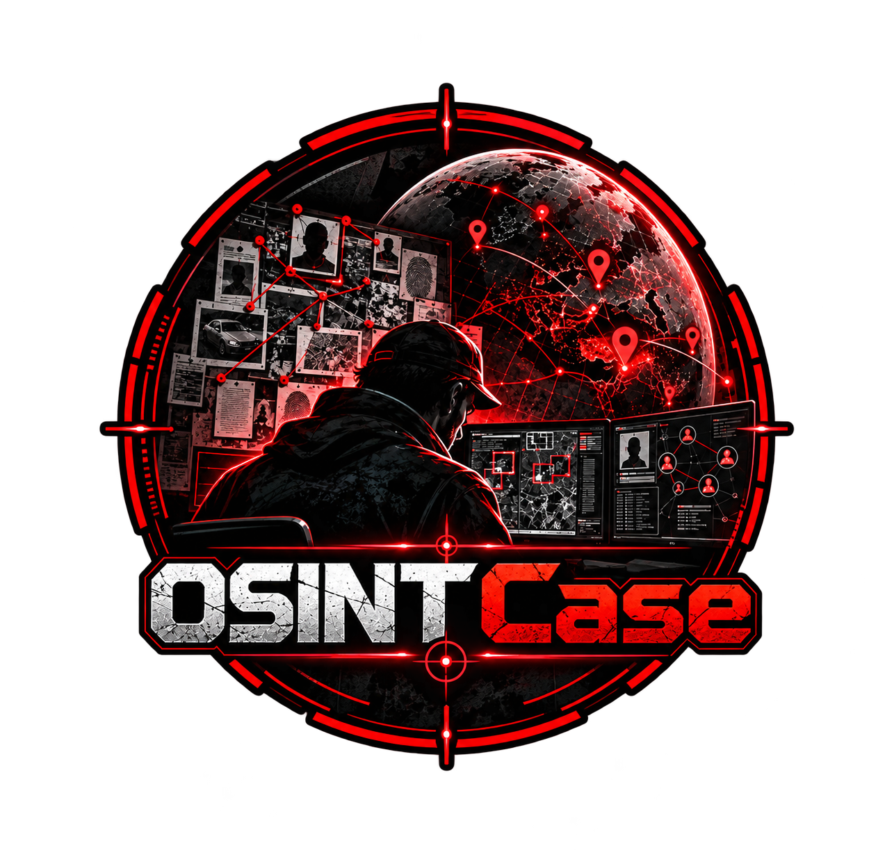
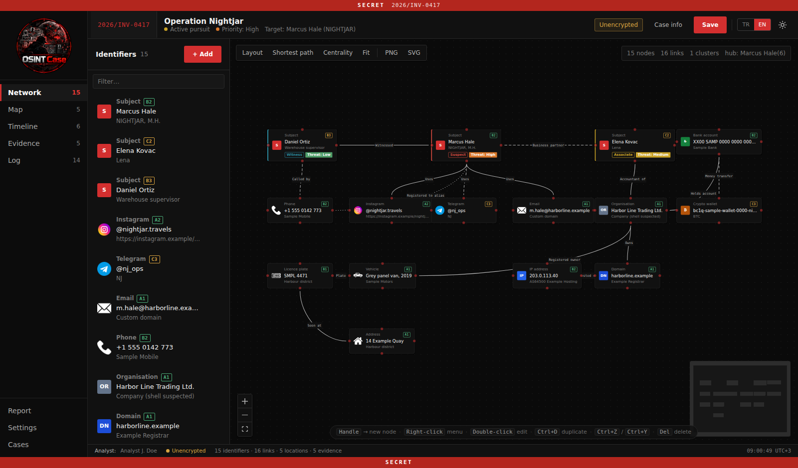
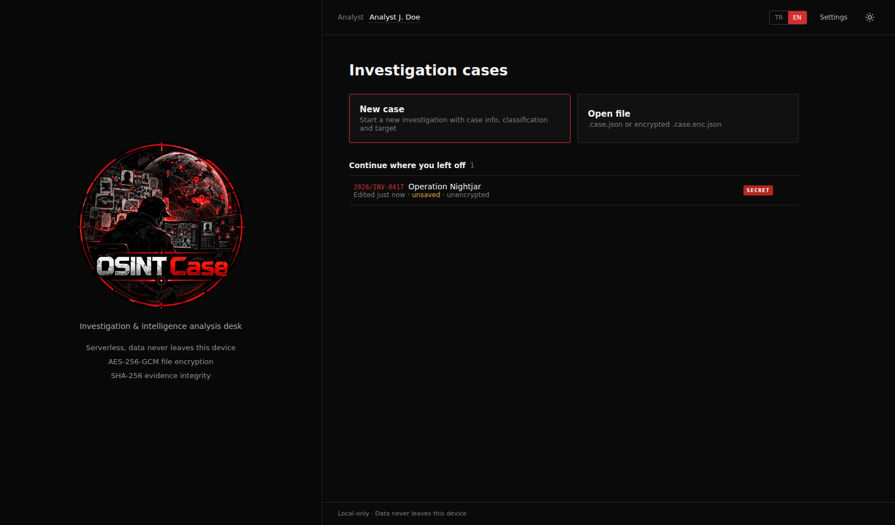
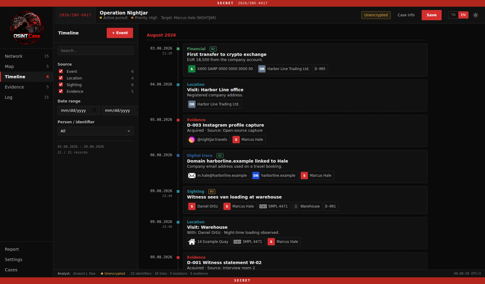
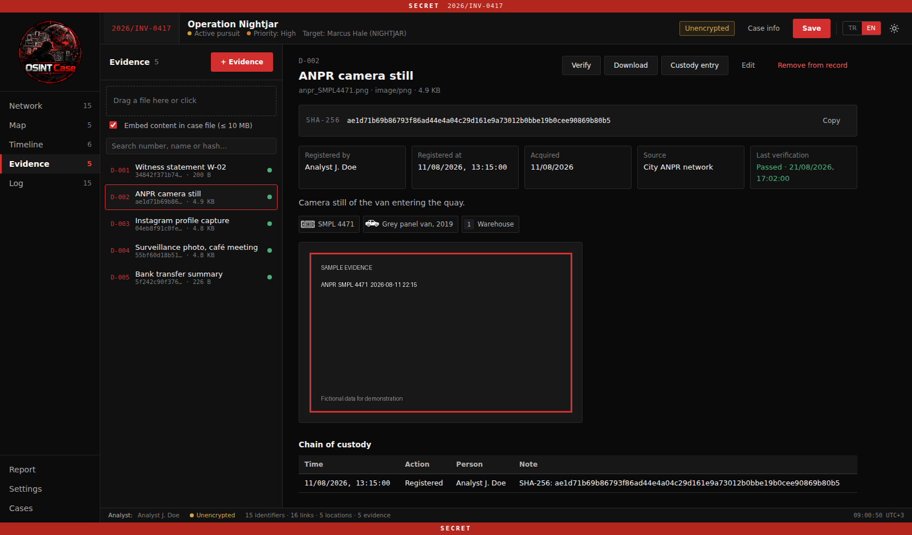
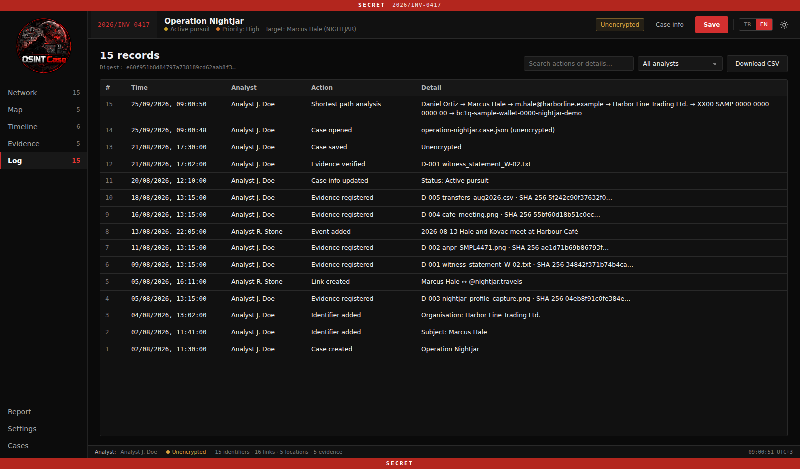
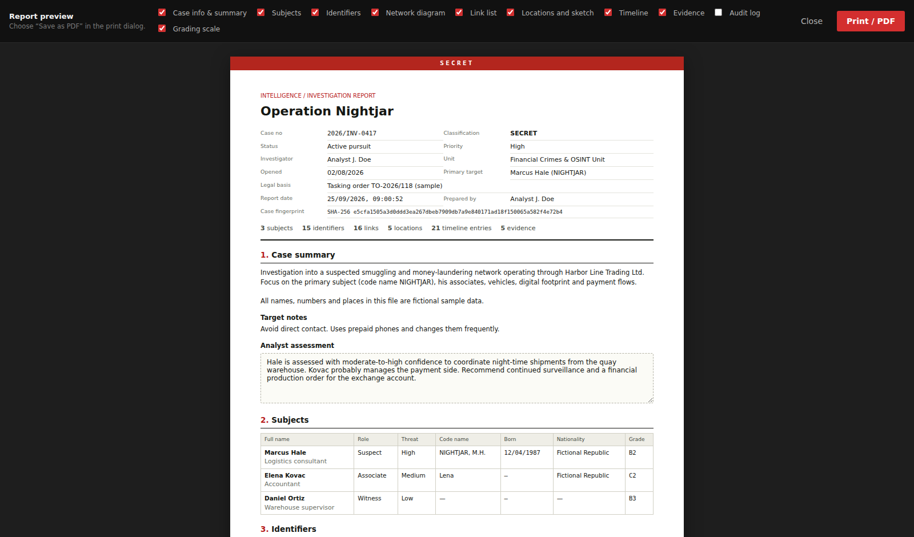

# OSINTCase

<p align="center">
  
</p>

> **Based on [OSINTMapper](https://github.com/Geistnigma/OSINTMapper) by [Geistnigma](https://github.com/Geistnigma).**
>
> This project is a modified and extended version of OSINTMapper with additional features and changes focused on investigation case management, intelligence analysis and evidence handling.

A browser-based OSINT investigation and case mapping tool.

Organize subjects, identifiers, relationships, locations, timelines and evidence in a single case file.



## Screenshots

| Home | Network |
|---|---|
|  |  |

| Timeline | Evidence |
|---|---|
|  |  |

| Audit Log | Report |
|---|---|
|  |  |

## Features

- Investigation case management
- Entity and identifier mapping (50+ types: people, acquaintances, employment, education, 25+ social platforms, breach records…)
- Subject photos: multiple main and additional photos per person, SHA-256 of each original
- Relationship and link analysis
- Location mapping
- Investigation timeline
- Evidence management
- SHA-256 evidence hashing
- Chain of custody
- Audit log
- Intelligence report generation: dark / light themes, subject profiles, redaction, watermark
- Report export as PDF (print engine, page numbers, classification band) and single-file HTML
- Case file import and export
- Optional AES-256-GCM encryption
- Turkish and English interface
- Dark and light themes
- Fully client-side

## Quick Start

Requires **Node.js 18+**.

```bash
npm install
npm run dev
```

Open `http://localhost:5173`.

## Docker

```bash
docker compose up --build
```

Then open `http://localhost:5173`.

## Sample Case

A fictional investigation is included:

`example/operation-nightjar.case.json`

Open the file from the application to explore the sample investigation.

More samples in `example/` (all people, organisations, numbers and places are fictional; photos are synthetic silhouettes, not real people):

| File | Language | Content |
|---|---|---|
| `operasyon-kara-sahin.case.json` | TR | Counter-terrorism style case with subject photos, new identifier types, map, timeline, evidence |
| `operation-nightjar-photos.case.json` | EN | Operation Nightjar with subject photos and the new identifier types |
| `ornek-raporlar/tr/` | TR | Dark PDF, light PDF (redacted + watermarked), single-file HTML reports |
| `ornek-raporlar/en/` | EN | The same outputs in English |

The report follows the interface language: switch TR / EN before exporting. The sample files can be regenerated with `python3 tools/ornek-dosya-uret.py` (needs Pillow).

`example/operation-nightjar-fotografli.case.json` is the same case with sample subject photos (synthetic silhouettes, not real people) and the new identifier types.

Sample report outputs are in `example/ornek-raporlar/`: dark PDF, light PDF (redacted + watermarked) and a single-file HTML report.

## Privacy

OSINT Case runs entirely in the browser.

No server, analytics or telemetry is used. Case data and evidence remain on the local device.

## License

[GPL-3.0](LICENSE)
